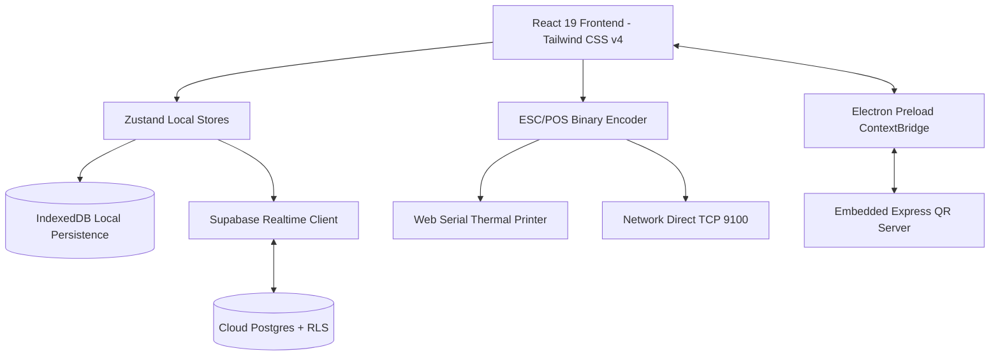

# EA POS — Master Architecture Guide

EA POS is an offline-first Point of Sale (POS) application built for retail, cafes, and restaurant environments. It supports standalone web usage, cross-platform Electron desktop packaging, hardware thermal printer connections, multi-terminal Supabase cloud sync, and digital QR menu serving.

## 🏗️ Technology Stack & Architecture Diagram



## 📚 Detailed Sub-References

- **Zustand State Stores Reference**: [references/state-stores.md](references/state-stores.md)
- **Tech Stack & Libraries**: React 19, Vite 6, Tailwind CSS v4, Zustand 5, Electron 43, Supabase JS v2, i18next v26.

---

## 📁 Core Directory Layout

```
src/
├── components/           # UI Views (Register, Inventory, ShiftScreen, Settings, etc.)
├── lib/                  # Pure math, pricing, hardware printers, Supabase sync
├── stores/               # Zustand state stores (auth, product, transaction, shift, etc.)
└── types.ts              # Global TypeScript interfaces
electron/                 # Electron main process, IPC handlers & Express QR server
scripts/                  # Database migration schemas & seed scripts
test/                     # Vitest unit & integration test suites
```

---

## ⚡ Key Rules for Developers

1. **Pure Math in `src/lib/`**: Subtotals, discounts, taxes, and split tender calculations must remain pure, side-effect-free functions in `src/lib/pricing.ts` and `src/lib/payments.ts`.
2. **Local-First State**: Always mutate local Zustand state immediately and persist to IndexedDB. Async Supabase sync runs in background.
3. **Strict HTML Escaping**: Sanitize all external strings rendered into raw HTML receipt templates using `escapeHtml()` from `src/lib/escapeHtml.ts`.
